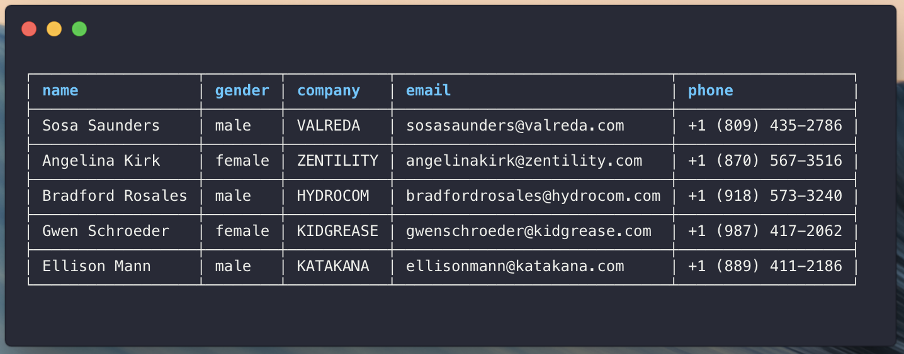

# ink-table

[](https://badge.fury.io/js/ink-table)

> A table component for [Ink](https://github.com/vadimdemedes/ink).

## Install

```bash
npm install ink-table
```

## Usage

```jsx
import Table from 'ink-table'

const data = [
  {
    name: 'Sosa Saunders',
    gender: 'male',
    age: 17,
    email: 'sosa.saunders@mail.com',
    phone: '+1 (809) 435-2786',
  },
  {
    name: 'Angelina Kirk',
    gender: 'female',
    age: 3,
    email: 'angelina@kirk.io',
    phone: '+1 (870) 567-3516',
  },
  {
    name: 'Bradford Rosales',
    gender: 'male',
    age: 20,
    email: 'bradfordrosales@fast.com',
    phone: '+1 (918) 573-3240',
  },
  {
    name: 'Gwen Schroeder',
    gender: 'female',
    age: 17,
    email: 'gwen@corp.xyz',
    phone: '+1 (987) 417-2062',
  },
  {
    name: 'Ellison Mann',
    gender: 'male',
    age: 5,
    email: 'ellisonmann@katakana.com',
    phone: '+1 (889) 411-2186',
  },
]

const Basic = () => <Table data={data} />

render(<Basic />)
```



## Documentation

```ts
type ScalarDict = {
  [key: string]: string | number | boolean | null | undefined
}

export type TableProps<T extends ScalarDict> = {
  /**
   * List of values (rows).
   */
  data: T[]
  /**
   * Columns that we should display in the table.
   */
  columns: (keyof T)[]
  /**
   * Cell padding.
   */
  padding: number
  /**
   * Header component.
   */
  header: (props: React.PropsWithChildren<{}>) => JSX.Element
  /**
   * Component used to render a cell in the table.
   */
  cell: (props: React.PropsWithChildren<{}>) => JSX.Element
  /**
   * Component used to render the skeleton of the table.
   */
  skeleton: (props: React.PropsWithChildren<{}>) => JSX.Element
}
```

## License

MIT © [Matic Zavadlal](http://github.com/maticzav)
